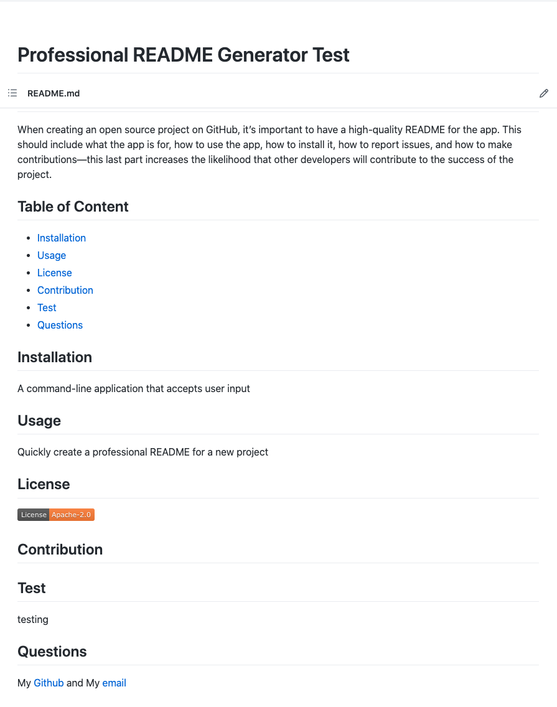

# README Generator
quickly and easily create a README file by using a command-line application to generate one.\n
[Index](./index.js)

## Finished Requirements
GIVEN a command-line application that accepts user input\n
WHEN I am prompted for information about my application repository\n
THEN a high-quality, professional README.md is generated with the title of my project and sections entitled Description, Table of Contents, Installation, Usage, License, Contributing, Tests, and Questions\n
WHEN I enter my project title\n
THEN this is displayed as the title of the README\n
WHEN I enter a description, installation instructions, usage information, contribution guidelines, and test instructions\n
THEN this information is added to the sections of the README entitled Description, Installation, Usage, Contributing, and Tests\n
WHEN I choose a license for my application from a list of options\n
THEN a badge for that license is added near the top of the README and a notice is added to the section of the README entitled License that explains which license the application is covered under\n
WHEN I enter my GitHub username\n
THEN this is added to the section of the README entitled Questions, with a link to my GitHub profile\n
WHEN I enter my email address\n
THEN this is added to the section of the README entitled Questions, with instructions on how to reach me with additional questions\n
WHEN I click on the links in the Table of Contents\n
THEN I am taken to the corresponding section of the README\n

## Generator
[Test output](./README_Generated.md)